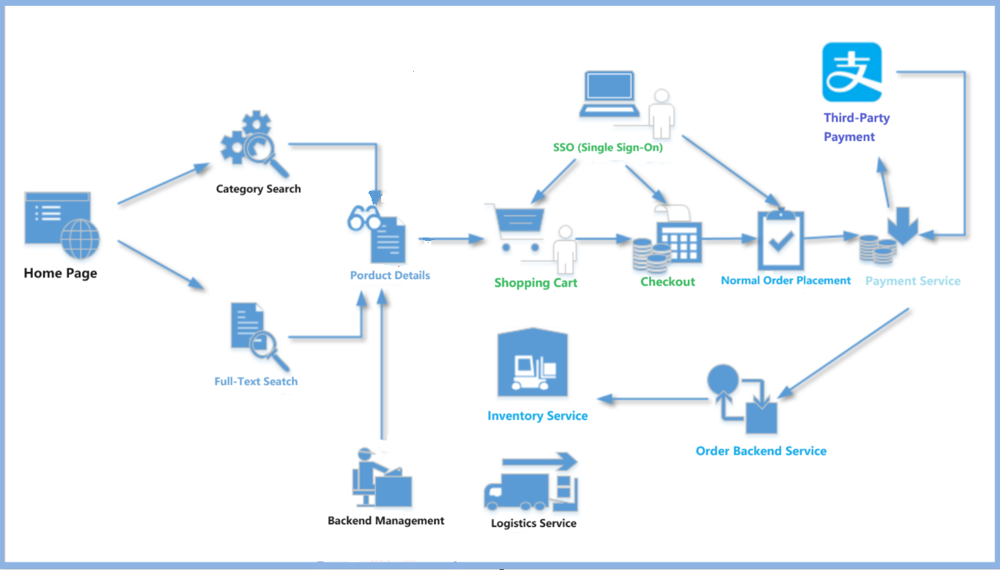
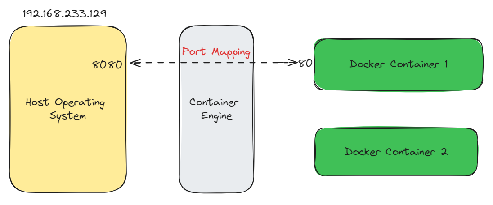
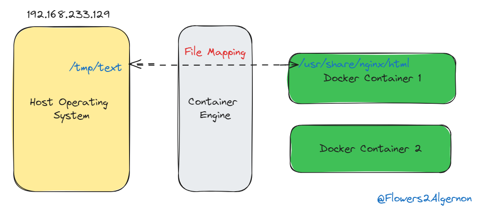
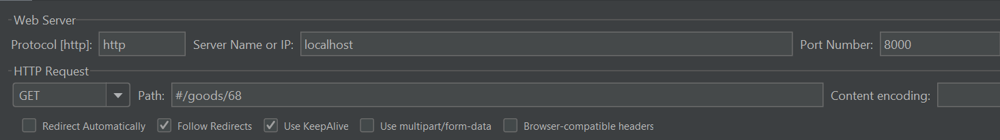
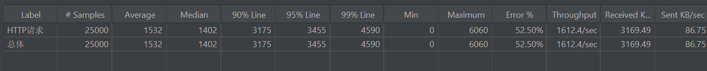

# DuoLaiMall - A Java backend online shopping mall project 

[![MIT][License-Image]][License-Url] [](https://github.com/alwitt/livemix/actions/workflows/cicd.yaml)

[License-Url]: https://mit-license.org/
[License-Image]: https://img.shields.io/badge/License-MIT-blue.svg
`DuolaiMall` is a Java backend online shopping mall project based on microservice architecture. The main technology stack includes Spring Cloud, Redis, Elasticsearch, RocketMQ, and others. This e-commerce system utilises a distributed architecture to provide a scalable and efficient platform for online retail operations. 

# Key Features

- The project leverages Spring Cloud to build and manage microservices.
- Use Redis for caching and session management.
- Implement Elasticsearch for powerful search capabilities,
- RocketMQ for message queuing and asynchronous communication between services. 

This combination of technologies enables the system to handle high concurrency, provide fast and accurate search results, and maintain data consistency across various components of the e-commerce platform.

# Overview



# Preparation Work

## Port Mapping

Containers inherently possess isolation characteristics, so different containers have independent network systems. As a result, two different containers can fully utilise the same ports internally and can use ports already in use on the host machine. These identical port numbers are unrelated and cannot communicate with each other over the network.

If you want to provide services externally through containers, you need to establish a mapping between the container's ports and the host machine's ports.

Port mapping can be achieved using the -p option with docker run;

```bash
#Map the host machine's port 8080 to the container's port 80
#-p: Specify port mapping, format: host port:container port
docker run -d -p 8080:80 nginx
```



## File Mapping

Containers inherently possess isolation characteristics, so different containers have independent file systems. Any modifications made inside a container will not affect the host machine or other containers. If a container is deleted, all data within it ceases to exit.

Therefore, if you want to access the data from a container even after it has been deleted(for example, data in a database), you need to map a specific directory inside the container to the host machine's file system.

This allows the data to be saved on the host machine, so that even if the container is deleted, we can still access the container's previous data on the host machine.

Data persistence can be achieved using the -v option with docker run;

```bash
docker run -d -p 8081:80 -v /tmp/text:/usrs/share/nginx/html nginx
```




The following containers will start

```
$ docker ps
CONTAINER ID   IMAGE     COMMAND         CREATED        STATUS       PORTS         NAMES
7ba1e06bcc72   rocketmqinc/rocketmq             "sh mqbroker -c /opt…"   4 days ago    Up About a minute   0.0.0.0:10909->10909/tcp, :::10909->10909/tcp, 9876/tcp, 0.0.0.0:10911->10911/tcp, :::10911->10911/tcp   rmqbroker
bf5324e09975   rocketmqinc/rocketmq             "sh mqnamesrv"           4 days ago    Up About a minute   10909/tcp, 0.0.0.0:9876->9876/tcp, :::9876->9876/tcp, 10911/tcp                                          rmqnamesrv
1b5b43941a37   kibana:7.8.0                     "/usr/local/bin/dumb…"   11 days ago   Up About a minute   0.0.0.0:5601->5601/tcp, :::5601->5601/tcp                                                                kibana
cd6fab6f72ef   elasticsearch:7.8.0              "/tini -- /usr/local…"   11 days ago   Up About a minute   0.0.0.0:9200->9200/tcp, :::9200->9200/tcp, 0.0.0.0:9300->9300/tcp, :::9300->9300/tcp                     elasticsearch
5954b873d79a   minio/minio                      "/usr/bin/docker-ent…"   2 weeks ago   Up About a minute   0.0.0.0:9000-9001->9000-9001/tcp, :::9000-9001->9000-9001/tcp                                            minio
48b909b35ccd   nacos/nacos-server:v2.2.0-slim   "bin/docker-startup.…"   2 weeks ago   Up About a minute   0.0.0.0:8848->8848/tcp, :::8848->8848/tcp, 0.0.0.0:9848->9848/tcp, :::9848->9848/tcp                     nacos
29035242989a   redis:6.2                        "docker-entrypoint.s…"   2 weeks ago   Up About a minute   0.0.0.0:6379->6379/tcp, :::6379->6379/tcp                                                                redis-server
1ca103e80a2f   mysql                            "docker-entrypoint.s…"   2 weeks ago   Up About a minute   0.0.0.0:3306->3306/tcp, :::3306->3306/tcp, 33060/tcp                                                     mysql

```


CompletableFuture



Before use multithread



